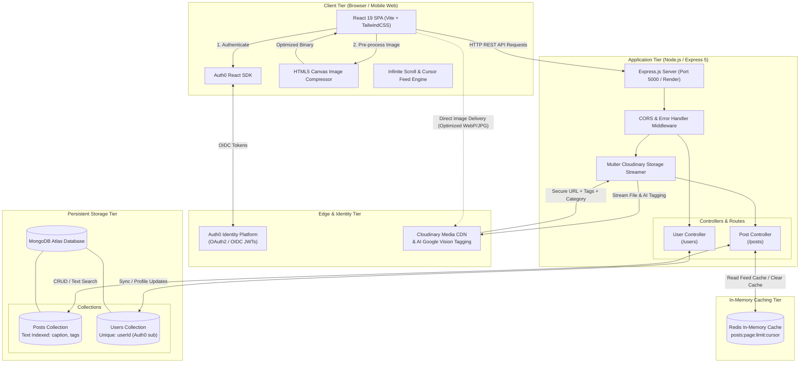
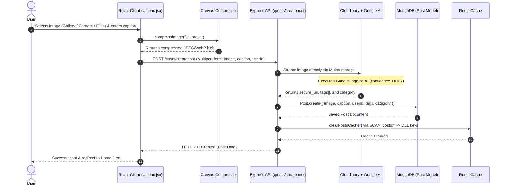
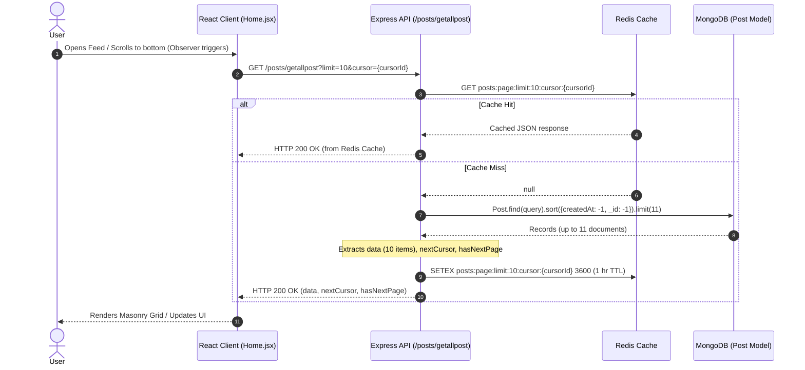
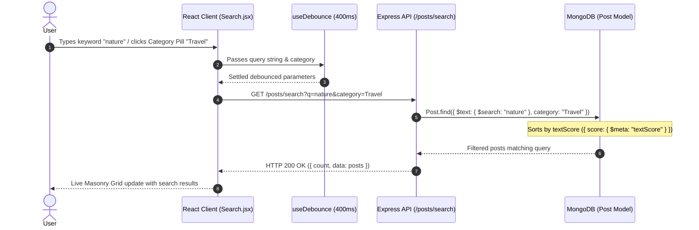
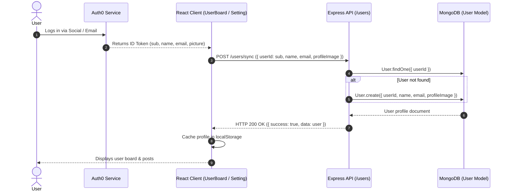
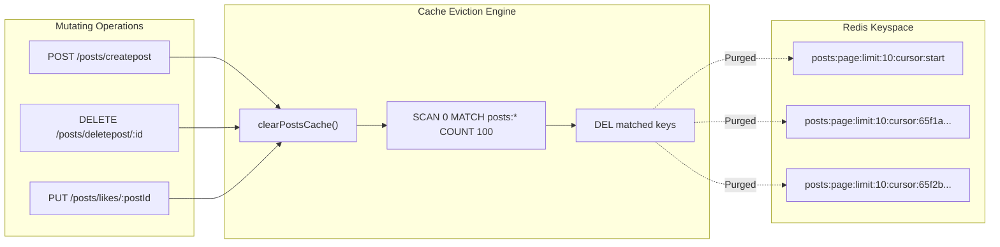

# SocialImage — High-Level Design (HLD) Document

## 1. Executive Summary

**SocialImage** is a full-stack, cloud-native social media and media-sharing platform designed for seamless image sharing, high-speed feed consumption, AI-driven categorization, and real-time content discovery.

The platform employs a decoupled client-server architecture:
- **Client Tier**: A mobile-first Single Page Application (SPA) built with **React 19**, **Vite**, and **TailwindCSS**, featuring client-side Canvas-based image optimization, Auth0 authentication, and a Pinterest-style masonry grid with infinite scroll.
- **Application Tier**: A modular RESTful API built on **Node.js** and **Express 5**, managing media ingestion pipelines, cache invalidation, and data synchronization.
- **Cache & Message Acceleration**: **Redis** for sub-millisecond cursor pagination caching with automated pattern-based cache clearing.
- **Database Tier**: **MongoDB (via Mongoose)** storing users, posts, text search indexes, and social interactions.
- **External Cloud Services**: **Cloudinary** for image CDN storage & Google AI auto-tagging, and **Auth0** as the OpenID Connect (OIDC) identity provider.

---

## 2. High-Level Architecture (HLD) Diagram

The following diagram illustrates the complete end-to-end system topology across clients, edge services, backend services, caching tiers, primary storage, and external SaaS providers.



---

## 3. Core Subsystems & Components

| Subsystem | Technology | Purpose & Responsibility |
| :--- | :--- | :--- |
| **Frontend Web App** | React 19, Vite, TailwindCSS | Dynamic UI, Masonry grid layout, search debounce, responsive curved navigation bar, and state management. |
| **Client Optimizer** | HTML5 Canvas API | Client-side image compression (`raw`, `high`, `standard` presets) before upload to save mobile bandwidth and reduce network latency. |
| **Authentication** | Auth0 Universal Login | Secure authentication (Google/Social/Email-Password), managing user sessions and sub-identifiers. |
| **Backend API** | Node.js (ESM), Express 5 | RESTful API endpoints for posts, user profiles, likes, search queries, and error handling. |
| **File Processing** | Multer + `multer-storage-cloudinary` | Multipart form processing, direct-to-cloud file streaming, and 5MB size limit validation. |
| **AI Tagging Engine** | Cloudinary Google Tagging Add-on | Automated image recognition; generates semantic tags and category classification upon upload. |
| **Cache Layer** | Redis (`redis` v5 npm) | High-speed caching for paginated feed queries (`posts:page:limit:X:cursor:Y`) with TTL and scan-based cache invalidation. |
| **Persistent DB** | MongoDB Atlas, Mongoose 8 | Stores structured records for Posts (with text indexes) and Users (with automatic age calculation hooks). |

---

## 4. End-to-End Sequence Workflows

### 4.1 Image Upload & AI Auto-Tagging Flow
The upload pipeline leverages client-side compression followed by Cloudinary's streaming upload and Google Tagging AI before committing metadata to MongoDB and invalidating the Redis cache.



---

### 4.2 Paginated Feed Retrieval & Redis Caching Flow
The feed implements a cursor-based pagination pattern to eliminate offset performance penalties and handle continuous infinite scrolling.



---

### 4.3 Full-Text Search & Discovery Flow
Searches are debounced on the client to avoid request hammering and executed against MongoDB's compound text index (`caption` and `tags`).



---

### 4.4 User Profile Synchronization & Lifecycle Flow
User authentication is managed externally by Auth0. The client synchronizes profile metadata with MongoDB upon sign-in.



---

## 5. Database Schema & Data Models

### 5.1 Post Model (`posts`)
```json
{
  "_id": "ObjectId",
  "image": "String (Cloudinary HTTPS URL)",
  "caption": "String (Trimmed, Max 300 chars)",
  "likes": ["Array of Strings (userIds)"],
  "userId": "String (Auth0 sub ID)",
  "tags": ["Array of Strings (Google AI generated)"],
  "category": "String (Default: 'General')",
  "createdAt": "ISODate",
  "updatedAt": "ISODate"
}
```
**Indexes**:
- Compound Text Index: `{ caption: "text", tags: "text" }` for high-performance full-text search.
- Secondary B-Tree: `{ createdAt: -1, _id: -1 }` for cursor pagination.

### 5.2 User Model (`users`)
```json
{
  "_id": "ObjectId",
  "userId": "String (Auth0 sub ID, Unique Index)",
  "name": "String",
  "email": "String",
  "dob": "Date (Nullable)",
  "age": "Number (Computed automatically via pre-save hook)",
  "bio": "String (Default: '')",
  "profileImage": "String (Cloudinary HTTPS URL)",
  "createdAt": "ISODate",
  "updatedAt": "ISODate"
}
```
**Hooks**:
- `pre("save")`: Automatically derives `age` integer from `dob` date comparison against current year and month.

---

## 6. Caching & Invalidation Architecture



- **Cache Keys**: Formatted as `posts:page:limit:<limit>:cursor:<cursor || 'start'>`.
- **TTL**: 3600 seconds (1 hour) default lifespan for feed pages.
- **Eviction Strategy**: Non-blocking `SCAN` iteration ensures the Redis thread is never blocked, even with millions of active keys.

---

## 7. Security & Non-Functional Attributes

1. **Authentication & Authorization**:
   - Authentication decoupled to Auth0 OIDC standard.
   - User identity keyed securely to Auth0 `sub` claim.
2. **Media Security & Validation**:
   - Multer middleware validates incoming MIME types (`jpg`, `jpeg`, `png`, `webp`).
   - Hard upload threshold enforced at 5MB with dedicated Multer error interceptor returning friendly status codes.
3. **CORS Governance**:
   - Strict origin allowlist supporting development (`http://localhost:5173`, `http://localhost:5000`) and production deployment (`https://socialimage-1.onrender.com`).
4. **Performance & Optimization**:
   - Multi-tier compression: Client-side Canvas downscaling (up to ~80% size savings) combined with Cloudinary automatic format/quality negotiation.
   - Cursor pagination prevents query degradation for deep feeds.
   - Client-side input debouncing (300ms–400ms) prevents API saturation on searches.

---

## 8. Directory & File Mapping

```
socialimage/
├── HLD.md                               # High-Level Architecture Documentation (This file)
├── README.md                            # Project Deployment Links
├── Backend/                             # Express.js REST API
│   ├── server.js                        # HTTP Server bootstrap & DB connection
│   ├── package.json                     # Backend dependencies & scripts
│   └── src/
│       ├── app.js                       # Express app configuration & middlewares
│       ├── config/
│       │   ├── db.js                    # MongoDB Mongoose connection
│       │   ├── redis.js                 # Redis client & cache invalidation logic
│       │   ├── cloudinary.js            # Cloudinary SDK credentials configuration
│       │   └── env.js                   # Environment variable loader
│       ├── controller/
│       │   ├── post.controller.js       # Post creation, cursor feed, search, likes
│       │   └── user.controller.js       # Profile sync & updates
│       ├── middlewares/
│       │   ├── upload.middlerware.js    # Multer + Cloudinary post image handler
│       │   └── profile.middleware.js   # Multer profile photo handler
│       ├── models/
│       │   ├── post.model.js            # MongoDB Post Schema & text index
│       │   └── user.model.js            # MongoDB User Schema & age hook
│       └── routes/
│           ├── post.route.js            # /posts API route definitions
│           └── user.route.js            # /users API route definitions
│
└── SocialImage/                         # React 19 Client SPA
    ├── package.json                     # Frontend dependencies
    ├── vite.config.js                   # Vite configuration
    ├── index.html                       # HTML document root
    └── src/
        ├── main.jsx                     # React root & Auth0Provider setup
        ├── App.jsx                      # Client router setup
        ├── Components/
        │   ├── Navbar.jsx               # Floating curved bottom navigation bar
        │   ├── SearchBar.jsx            # Category filter pills & search input
        │   └── MasonryGrid.jsx          # CSS-column responsive image grid
        ├── routes/
        │   ├── Home.jsx                 # Infinite scroll feed with cursor pagination
        │   ├── Search.jsx               # Real-time debounced search & category discovery
        │   ├── Upload.jsx               # Multi-source photo drawer & upload form
        │   ├── UserBoard.jsx            # User profile dashboard & uploaded post manager
        │   └── Setting.jsx              # User preferences, compression preset & profile editor
        ├── utils/
        │   └── compressor.js            # Client-side HTML5 Canvas image compressor
        └── hooks/
            └── useDebounce.js           # Debounce hook for instant search queries
```
